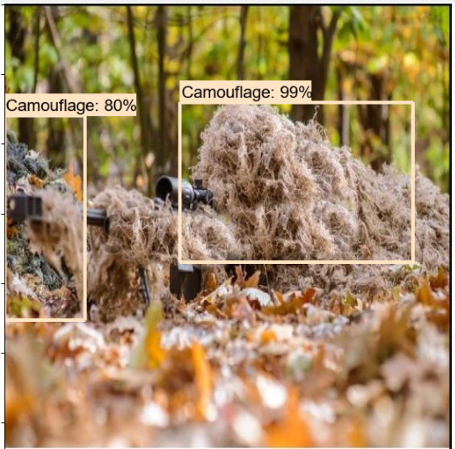

# camouflage-with-tfod

`Configuration steps for TensorFlow object detection`

STEP-1 Download the following content-

1. Download v1.13.0 model.
2. Download the ssd_mobilenet_v1_coco model from the model zoo or any other model of your choice from Tensorflow 1 Detection Model Zoo.
3. Download Dataset $ utils.
4. Download labelImg tool for labeling Images.

Before extraction, you should have the following compressed files.

STEP-2 Extract all the above zip files into tfod folder and remove the compressed files-

STEP-3 Creating virtual env using conda-

`Commands`

for specific python version

`conda create -n your_env_name python=3.7`

activate the environment

`conda activate your_env_name`

STEP-4 Install the following packages in your new environment-

**for GPU**

`pip install pillow lxml Cython contextlib2 jupyter matplotlib pandas opencv-python tensorflow-gpu==1.15.0`

**for CPU only**

`pip install pillow lxml Cython contextlib2 jupyter matplotlib pandas opencv-python tensorflow==1.15.0`

STEP-5 Install protobuf using conda package manager-

`conda install -c anaconda protobuf`

STEP-6 For protobuff to .py conversion download from a tool from here-

For windows -> download source for other versions and OS - click here

Open command prompt and cd to research folder.

Now in the research folder run the following command-

`Now in the research folder run the following command-`

**For Linux or Mac**
`protoc object_detection/protos/*.proto --python_out=.`

**For Windows**
`protoc object_detection/protos/*.proto --python_out=.`

`STEP-7 Paste all content present in utils into research folder-`

Following are the files and folder present in the utils folder-

STEP-9 Run the following to generate train and test records-

from the research folder-

`python generate_tfrecord.py --csv_input=images/train_labels.csv --image_dir=images/train --output_path=train.record`

`python generate_tfrecord.py --csv_input=images/test_labels.csv --image_dir=images/test --output_path=test.record`

STEP-10 Copy from **research/object_detection/samples/config/YOURMODEL.config** file into **research/training-**

`Note`

The following config file shown here is with respect to **ssd_mobilenet_v1_coco.** So if you have downloaded it for any other model apart from SSD you'll see config file with YOUR_MODEL_NAME as shown below-

`
    model {
    YOUR_MODEL_NAME {
        num_classes : 6
        box_coder {
            faster_rcnn_box_coder {
`
**Hence always verify YOUR_MODEL_NAME before using the config file.**

STEP-11 Update **num_classes, fine_tune_checkpoint**, and **num_steps** plus update **input_path** and **label_map_path** for both **train_input_reader** and **eval_input_reader-**

STEP-12 From **research/object_detection/legacy/** copy **train.py** to research folder

legacy folder contains train.py as shown below-

STEP-13 Copy **deployment** and **nets** folder from **research/slim** into the **research** folder-

slim folder contains the following folders-

STEP-14 NOW Run the following command from the **research** folder. This will start the training in your **local system-**

`Note`
 copy the command and replace **YOUR_MODEL.config** with your own model's name for example **ssd_mobilenet_v1_coco.config** and then run it in cmd prompt or terminal. And make sure you are in research folder.

`python train.py --logtostderr --train_dir=training/ --pipeline_config_path=training/YOUR_MODEL.config`

**Result**

